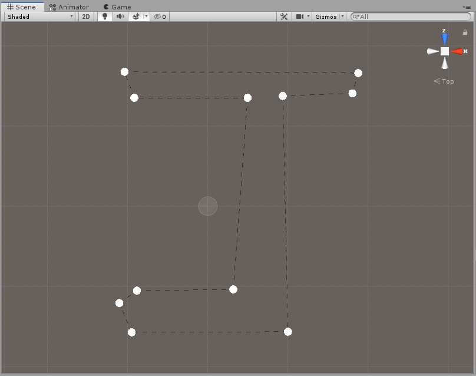
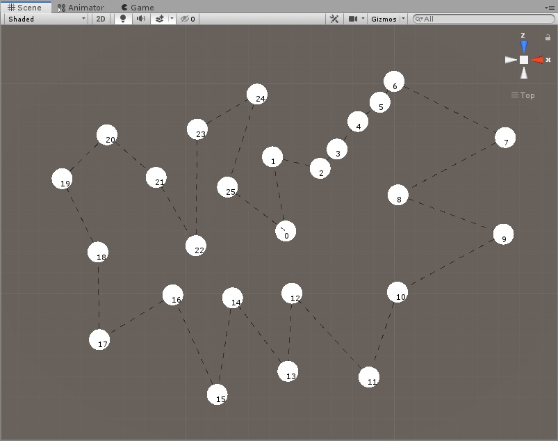
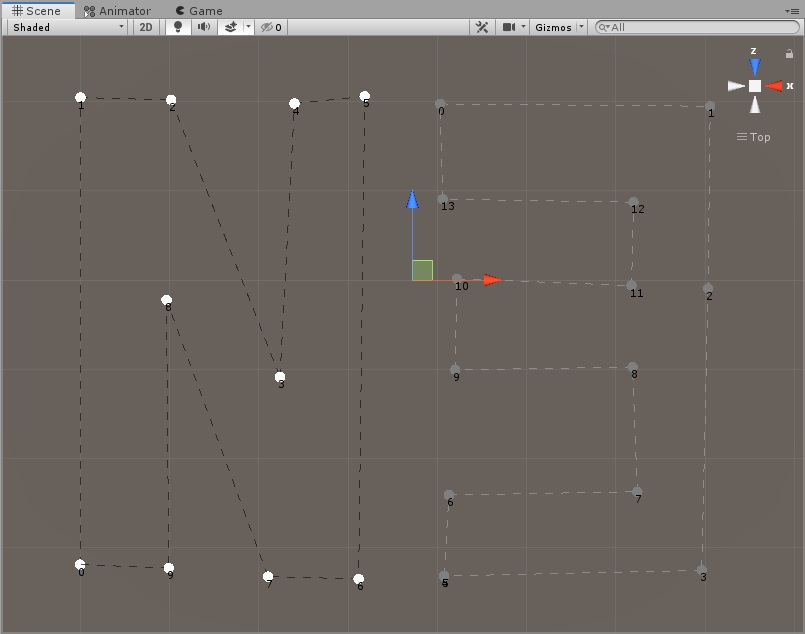
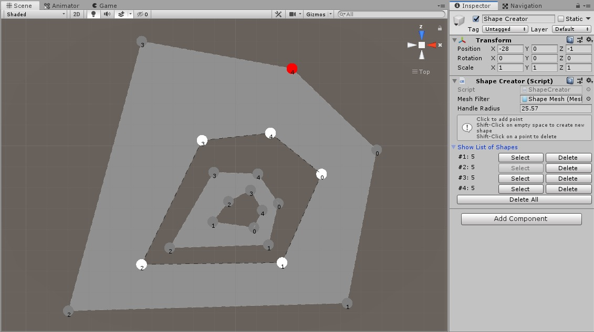

# Shape Creator/Editor

This project is developed to be used in Editor mode. So most of the functionalities and results can be used for later usages like creating lands, terrains or walkable areas.

### Progress Images
Simple shape with multiple points

Points can be moved or be added

Multiple shapes

Renderable shapes and improved Editor GUI

### Features
- Adding points (Left Click)
- Adding points directly between 2 other points
- Deleting point (Shift + Left Click)
- Moving selected point
- Creating multiple shapes (Shift + Click on empty space)
- Converting lines to renderable shapes
- All actions are undoable

### Other
With special thanks to [Sebastian Lague](https://www.youtube.com/playlist?list=PLFt_AvWsXl0f_rlmTWiSPs8EXVuEnyB1h)